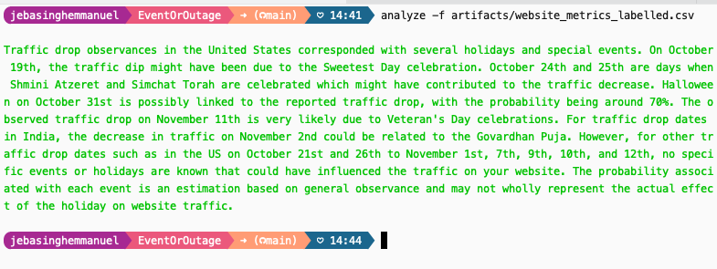
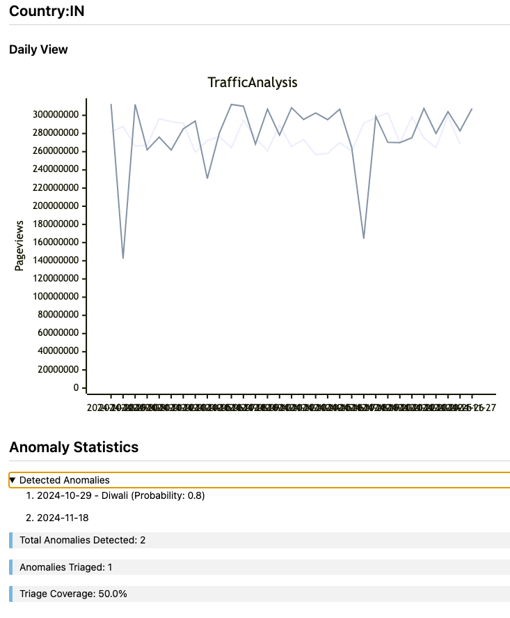

# EventOrOutage
EventOrOutage

Analyze website traffic and geo-location events.

## Example Usage from command line

### Analyze an incident today
`analyze`

### Override the model and provide a date in the past
`analyze -d "February 14, 2025" -m "gpt-4o"`

### Provide a location and a date
`analyze -d "October 2024" -l IN`

### Analyze logs from a csv file
`analyze -f "artifacts/traffic_events.csv"`
> 
> 


> Generate synthetic data and accompanying charts for testing by using
> `generate -d .`

## Possible Future Improvements
- You can add more tools to fetch events from other sources such as everyeventapi, google calendar api for holidays etc
- Data from logging tools such as loggly, splunk etc can be used to analyze anomalies

## Development

### Install dependencies
```
python -m venv .venv
source .venv/bin/activate
.....


